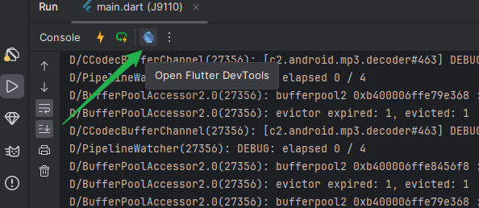
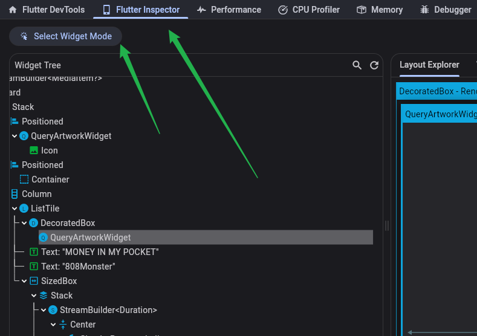
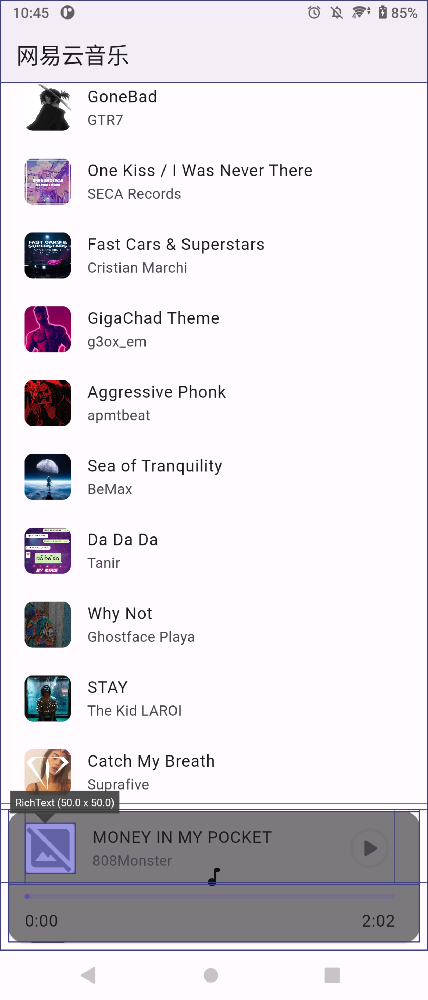
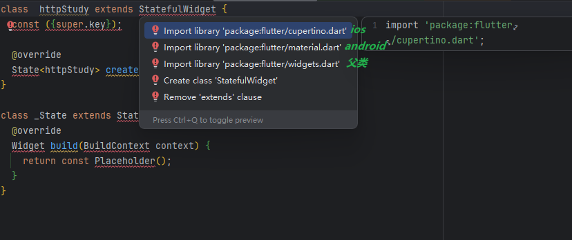

# Flutter学习

## windows打开环境变量

```
win + pause
```

## Android Studio进入欢迎界面

1. 点击菜单“File”-“Close Project”关闭当前打开的工程

## 如何审查元素








## 关于 Android Studio  和 Flutter  版本兼容

### Gradle和 Java 版本不兼容

注意看官网 环境搭建 对 Android Studio 版本的要求
Flutter 需要完整版本的 Android Studio 来调试和编译 Android 的 Java 或 Kotlin 代码

比如现在官方的要求：

- Android Studio 2023.3.1 (Jellyfish) 或更高版本来调试和编译 Android 的 Java 或 Kotlin 代码。 Flutter 需要完整版本的 Android Studio。

假设你正在使用 旧版本的 Flutter SDK ，而 Android Studio 使用的是最新版本。则可能会导致 java版本与Gradle版本 冲突或者说 不匹配：会报错 `gradle:compileGroovy` 以及  `major version 65` 

```
* What went wrong:
Execution failed for task ':gradle:compileGroovy'.
> BUG! exception in phase 'semantic analysis' in source unit 'C:\Users\cat20\Desktop\flutter\packages\flutter_tools\gradle\src\main\groovy\app_plugin_loader.groovy' Unsupported class file major version 65
```

`编译安卓的时候 使用的是 Android Studio 内置的 java 版本，而不是计算机本地的 `

我们可以输入命令查看:

```
flutter doctor -v
```

```
[√] Flutter (Channel stable, 3.19.3, on Microsoft Windows [版本 10.0.22631.4460], locale zh-CN)
    • Flutter version 3.19.3 on channel stable at C:\Users\cat20\Desktop\flutter
    • Upstream repository https://github.com/flutter/flutter.git
    • Framework revision ba39319843 (9 months ago), 2024-03-07 15:22:21 -0600
    • Engine revision 2e4ba9c6fb
    • Dart version 3.3.1
    • DevTools version 2.31.1

[√] Windows Version (Installed version of Windows is version 10 or higher)

[√] Android toolchain - develop for Android devices (Android SDK version 34.0.0)
    • Android SDK at C:\Users\cat20\AppData\Local\Android\Sdk
    • Platform android-34-ext8, build-tools 34.0.0
    • ANDROID_HOME = C:\Users\cat20\AppData\Local\Android\Sdk
    • ANDROID_SDK_ROOT = C:\Users\cat20\AppData\Local\Android\Sdk
    • Java binary at: C:\Program Files\Android\Android Studio\jbr\bin\java
    • Java version OpenJDK Runtime Environment (build 17.0.10+0--11572160)
    • All Android licenses accepted.

[√] Chrome - develop for the web
    • Chrome at C:\Program Files\Google\Chrome\Application\chrome.exe

[X] Visual Studio - develop Windows apps
    X Visual Studio not installed; this is necessary to develop Windows apps.
      Download at https://visualstudio.microsoft.com/downloads/.
      Please install the "Desktop development with C++" workload, including all of its default components

[√] Android Studio (version 2024.2)
    • Android Studio at C:\Program Files\Android\Android Studio
    • Flutter plugin can be installed from:
       https://plugins.jetbrains.com/plugin/9212-flutter
    • Dart plugin can be installed from:
       https://plugins.jetbrains.com/plugin/6351-dart
    • Java version OpenJDK Runtime Environment (build 17.0.10+0--11572160)

[√] IntelliJ IDEA Ultimate Edition (version 2024.1)
    • IntelliJ at D:\IntelliJ IDEA 2024.1.4
    • Flutter plugin can be installed from:
       https://plugins.jetbrains.com/plugin/9212-flutter
    • Dart plugin can be installed from:
       https://plugins.jetbrains.com/plugin/6351-dart

[√] Connected device (4 available)
    • J9110 (mobile)    • QV713U7T1T • android-arm64  • Android 11 (API 30)
    • Windows (desktop) • windows    • windows-x64    • Microsoft Windows [版本 10.0.22631.4460]
    • Chrome (web)      • chrome     • web-javascript • Google Chrome 131.0.6778.86
    • Edge (web)        • edge       • web-javascript • Microsoft Edge 130.0.2849.68

[√] Network resources
    • All expected network resources are available.

! Doctor found issues in 1 category.

```

可以看到目前 Android Studio 内置Java版本 为17

```
Java version OpenJDK Runtime Environment (build 17.0.10+0--11572160)
```

出于 对旧项目的原因，我的 flutter 并未使用最新的 SDK

输入 `flutter --version`，目前我的版本是 `3.19.3`，并不是最新的 `3.24.4`，所以当我在使用最新版 2024.3.1 的 Android Studio的时候就会导致 Gradle和 Java 版本不兼容，因为2024.3.1 的 Android Studio 内置Java 版本是21

在这里 给大家提供 Android Studio 历史版本下载地址，如网址打不开的 请自行科学上网
https://developer.android.google.cn/studio/archive

```
Flutter 3.19.3 • channel stable • https://github.com/flutter/flutter.git
Framework • revision ba39319843 (9 months ago) • 2024-03-07 15:22:21 -0600
Engine • revision 2e4ba9c6fb
Tools • Dart 3.3.1 • DevTools 2.31.1
```

同时，我们需要 了解特定 Gradle 版本支持的 Java 版本：

参考官网：https://docs.gradle.org/current/userguide/compatibility.html#java

| Java version | Support for toolchains | Support for running Gradle |
| :----------- | :--------------------- | :------------------------- |
| 8            | N/A                    | 2.0                        |
| 9            | N/A                    | 4.3                        |
| 10           | N/A                    | 4.7                        |
| 11           | N/A                    | 5.0                        |
| 12           | N/A                    | 5.4                        |
| 13           | N/A                    | 6.0                        |
| 14           | N/A                    | 6.3                        |
| 15           | 6.7                    | 6.7                        |
| 16           | 7.0                    | 7.0                        |
| 17           | 7.3                    | 7.3                        |
| 18           | 7.5                    | 7.5                        |
| 19           | 7.6                    | 7.6                        |
| 20           | 8.1                    | 8.3                        |
| 21           | 8.4                    | 8.5                        |
| 22           | 8.7                    | 8.8                        |
| 23           | 8.10                   | 8.10                       |
| 24           | N/A                    | N/A                        |

### 知识拓展：

开发 **Flutter** 时需要注意 **Gradle 版本** 和 **Android Studio 内置 Java 版本** 的原因，主要是由于 Flutter 项目在构建 Android 应用时，依赖于 Android 的构建工具链，而这些工具之间存在版本依赖和兼容性要求。

------

#### Gradle 和 Android Studio 的作用

1. **Gradle 的作用**：
   - Gradle 是 Android 项目的核心构建工具，用于：
     - 下载和管理依赖（如支持库、第三方插件）。
     - 打包应用（APK 或 AAB 文件）。
     - 编译和优化代码。
     - 管理多模块项目。
2. **Android Studio 的作用**：
   - Android Studio 是集成开发环境（IDE），提供 Flutter 开发的可视化支持。
   - 它包含 Android SDK、构建工具（如 AAPT）、模拟器等。
   - **内置的 Java JDK** 用于运行 Gradle 和 Android 构建工具链。

------

#### 为什么 Flutter 需要完整版本的 Android Studio？

1. **Flutter 和 Android 的深度依赖**：
   - Flutter 的 Android 部分（如 `android/app`）是基于原生的 Android 构建工具链。
   - 构建时需要依赖 Android Gradle 插件（AGP）、Gradle 和 Java，因此需要 Android Studio 提供这些工具。
2. **Gradle 版本与 Android Gradle 插件的依赖关系**：
   - Android Gradle 插件（AGP）是连接 Gradle 和 Android SDK 的核心插件，不同版本的 AGP 对应特定的 Gradle 版本。
   - 若 Gradle 版本与 AGP 或 Java 版本不兼容，会导致构建失败。
3. **内置 Java 版本的影响**：
   - Gradle 和 AGP 运行时需要 Java 环境。
   - Android Studio 提供的内置 Java JDK 与 SDK、工具链是经过测试的，使用其他版本可能出现不兼容。

------

#### 常见问题

1. **Gradle 和 Java 版本不匹配**

- **原因**：Gradle 的版本对运行时 Java 版本有严格要求，使用过高或过低的版本可能导致错误。
- **解决方法**：确保 Gradle 版本与 Java 版本匹配（参考 [Gradle 和 Java 版本兼容性](https://docs.gradle.org/current/userguide/compatibility.html#java)）。

2. **AGP 与 Gradle 不匹配**

- **原因**：不同版本的 Android Gradle 插件（AGP）需要特定版本的 Gradle。
- **解决方法**：参考 [AGP 版本兼容性文档](https://developer.android.com/studio/releases/gradle-plugin#updating-gradle) 来设置正确的版本。

3. **构建工具版本低**

- **原因**：Flutter 依赖的 Android SDK Build Tools 版本低于项目要求。
- **解决方法**：更新 Android Studio，确保安装最新的 Build Tools 和 SDK。

------


## flutter doctor 问题解决

### Android Studio  Unable to determine bundled Java version

我的解决方法：更新重新安装  Android Studio 后，我的目录是C:\Program Files\Android\Android Studio1 ，得吧这个1去掉

网上的办法 都不靠谱比如 终端输入：

```
flutter doctor --android-licenses
```

比如：
第一步：打开文件夹 C:\Program Files\Android\Android Studio

第二步：复制一份 jbr 文件夹，并将它重命名为 jre
官方 Issues：https://github.com/flutter/flutter/issues/118502

### Error: Gradle build failed to produce an .apk file. It's likely that this file was generated under 

在 `android/app/build.gradle` 文件中 把这个代码注释掉

```
// productFlavors {
    //     github {
    //         dimension "flavor"
    //         applicationIdSuffix ""
    //     }
    //     fdroid {
    //         dimension "flavor"
    //         applicationIdSuffix ".fdroid"
    //     }
    // }
```


## 探索 Android Studio

https://developer.android.com/studio/intro?hl=zh_cn

### 插件安装

需要安装以下插件：

1. Dart
2. Flutter

推荐插件：

1. CodeGlance Pro   代码侧边显示
2. Rainbow Brackets   
3. Flutter Snippets

### Android Studio 快捷键

- 快速创建Widget:在dart文件中输入stf或stl出现提示后按回车即可
- 快速修复:option + 回车
- 自动生成构造函数:选中 final 参数，快捷键:option+回车
- 添加父组件、变为子组件、删除子组件:option+回车
- 万能的搜索:双击shift
- 查看最近打开的文件:command+E
- 重命名:fn+shift+f6
- 查看当前类结构:command +fn +f12
- 查看源码:将光标放到要查看源码的类名或方法名上，长按command 然后的点击
- 查看类的子类:选中要查看的类，然后:command+B或option +command + B
- 将代码更新到模拟器上:选中模拟器然后command+R
- 导入类的快捷键:将光标放在要导入类的上面，然后按option+enter
- 全局搜索:command +shift +F
- 全局替换:command + shift + R
- 查找引用:option + shift + F7

以上快捷键是在Android Studio 的macOS的keymap下，如果是Windows系统，将command 换成 Ctrl，option 换成Alt 即可

## 环境搭建

官方文档：

https://docs.flutter.cn/get-started/install/windows/mobile

## 历史版本 Flutter SDK 归档列表

https://docs.flutter.cn/release/archive

## 命令

### 检查dart sdk版本

```
dart --version

Dart SDK version: 3.3.1 (stable) (Wed Mar 6 13:09:19 2024 +0000) on "windows_x64"
```

### 创建项目

```
flutter create 项目名字
```


### 检查flutter版本

```
flutter --version
```

### 检查环境 doctor

```
flutter doctor
```

### 项目启动 run

```
flutter run
```

### 下载依赖 pub get

```
flutter pub get
```

### 升级依赖 pub upgrade

```
flutter pub upgrade
```

### 重建项目

```
flutter clean
flutter pub get
flutter run
```

### 列出依赖树

```
flutter pub deps

说明：比如我需要知道 pubspec.yaml 中的依赖有没有去依赖win32 这个包，在项目根目录下运行这个命令，它会显示所有的依赖树，然后按ctrl + f 搜索帮助你找到可能引入 win32 的包。
```


## 关于版本

在 `pubspec.yaml` 文件中的 `environment` 字段，`sdk` 版本指的是 Dart SDK 的版本，而不是 Flutter 的版本。你的配置：

```
environment:
  sdk: '>=3.2.0 <4.0.0'

```

```
Flutter 3.19.3 • channel stable • https://github.com/flutter/flutter.git
Framework • revision ba39319843 (8 months ago) • 2024-03-07 15:22:21 -0600
Engine • revision 2e4ba9c6fb
Tools • Dart 3.3.1 • DevTools 2.31.1
```

### 关于项目不能启动

```
../../AppData/Local/Pub/Cache/hosted/pub.dev/win32-5.2.0/lib/src/guid.dart:32:9: Error: Type 'UnmodifiableUint8ListView' not found.
```

如果项目启动报错出现类似的错误、请尝试降低SDK版本

## Flutter 版本和 Dart 版本之间的区别

1. **Flutter 版本**：
   - Flutter 是一个 UI 工具包，用于构建跨平台应用，包括移动、Web 和桌面应用。
   - Flutter 版本通常包含了 Dart SDK 的特定版本。每个 Flutter 版本都有自己捆绑的 Dart 版本，确保与 Flutter 框架的功能和特性兼容。
   - Flutter 版本的更新通常包括新特性、bug 修复和性能改进。
2. **Dart 版本**：
   - Dart 是 Flutter 使用的编程语言。它是一个面向对象的语言，专为客户端开发而设计。
   - Dart 版本的更新可能引入新语法、语言特性和库，但这些更新不一定与 Flutter 的更新相同。
   - Dart 版本可以单独用于其他非 Flutter 的应用程序，比如服务器端应用。

关联性

- Flutter 版本与 Dart 版本是紧密相关的：每个 Flutter 版本都包含一个特定版本的 Dart。因此，如果你在使用 Flutter，你实际上也在使用与之对应的 Dart 版本。
- 例如，Flutter 2.x 可能捆绑 Dart 2.12，而 Flutter 3.x 可能捆绑 Dart 2.17。

兼容性

- 在开发中，确保你的 Dart SDK 版本与 Flutter 版本兼容是很重要的。某些库和插件可能依赖于特定版本的 Dart 或 Flutter，因此保持兼容性可以避免潜在的问题。

总结来说，Flutter 是一个框架，而 Dart 是其使用的编程语言，两者之间有相互依赖和关联。

## Dart 语言基础

### 符号?

`?` 是空安全类型声明

作用：

- 当在变量类型后加上 `?`，表示这个变量的值可以为 `null`。
- 如果没有 `?`，则这个变量不能为 `null`，否则会报编译错误。

示例：

```dart
String? text; // 变量 text 可以为 null
text = null;  // 合法

String text2; // 变量 text2 不能为 null
text2 = null; // 会报错
```

### 符号?.

`?.` 是空安全访问操作符

作用：

- 当在对象的成员访问中使用 `?.` 时，Dart 会先检查这个对象是否为 `null`。
- 如果对象为 `null`，整个表达式会返回 `null`，而不会抛出运行时异常。
- 如果对象不为 `null`，则会继续访问它的成员。

示例：

```dart
String? text = null;
// 使用 ?. 安全访问
print(text?.length); // 输出 null，不会报错

```

相对于传统的访问（`text.length`），如果 `text` 为 `null`，则会抛出异常：

```dart
print(text.length); // 会抛出错误：Null check operator used on a null value
```


### 符号 ??

`??` 是 Dart 中的 **空合运算符**，用于在操作中提供一个默认值。

- 如果左侧的表达式为 `null`，则返回右侧的值。
- 如果左侧的表达式不为 `null`，则返回左侧的值。

### 符号  $

`$` 是 Dart 中用于 **字符串插值** 的符号，通常用于在字符串中嵌入变量或表达式的值。

**基本用法：**

1. 直接嵌入变量：

   ```dart
   var name = 'Dart';
   print('Hello, $name!'); // 输出：Hello, Dart!
   ```

2. 嵌入表达式时，需要用 `{}` 包裹：

   ```dart
   var a = 2, b = 3;
   print('The sum of a and b is ${a + b}.'); // 输出：The sum of a and b is 5.
   ```

3. 如果变量名后接其他字符（如：方法调用、属性访问），需要用 `{}`：

   ```dart
   var name = 'Dart';
   print('The first letter is ${name[0]}.'); // 输出：The first letter is D.
   ```

```dart
// 入口函数、可以独立运行
void main() {
  test();
}

test() {
  String string = 'hello worle';
  print(string);
}
```


### dynamic、var、0bject的使用与区别

```
///1、dynamic:是所有Dart对象的基础类型，在大多数情况下，通常不直接使用它,
///通过它定义的变量会关闭类型检查，这意味着 dynamic x='hal';x.foo();
///这段代码静态类型检查不会报错，但是运行时会crash，因为x并没有foo()方法，所以建议大家在编程时不要直接使用dynamic:
///2、var:是一个关键字，意思是“我不关心这里的类型是什么。”，系统会自动推断类型runtimeType;
///3、0bject:是Dart对象的基类，当你定义:0bject o=xxx;时这时候系统会认为o是个对象;
///你可以调用o的toString()和hashCode()方法因为0bject提供了这些方法;
///但是如果你尝试调用0.foo()时，静态类型检查会进行报错;
///综上不难看出dynamic与0bject的最大的区别是在静态类型检查上;
```


```dart
// 入口函数、可以独立运行
void main() {
  // sum(1, 2);
  // 如何调用 类里面的方法
  FunctionSum functionSum = FunctionSum();
  functionSum.sum(1, 2, isPrint: true);
}

///方法的构成
///返回值类型 +方法名 + 参数
///其中:返回值类型可缺省，也可为void或具体的类型
///方法名:医名方法不需要方法名
///参数:参数类型和参数名，参数类型可缺省(另外，参数又分可选参数和参数默认值，可参考面向对象一节中构造方法部分的讲解///isPrint为可选参数，false是isPrint的默认值)

class FunctionSum {
  int sum(int val1, int val2, {bool? isPrint = false}) {
    var result = val1 + val2;
    if (isPrint ?? false) {
      print('result:$result');
    }
    return result;
  }
}

```

## Widget

### Widget 列表

### 如何快速创建Widget

输入  `stf`  回车 有状态

输入  `stl`  回车 无状态



### StatefulWidget 

StatefulWidget：无状态

###  StatelessWidget

StatelessWidget：可变状态

使用`setState`方法管理StatefulWidget的状态的改变


## ListView

`ListView` 是 Flutter 中一个非常常用的滚动列表控件。它是一个可以垂直或水平滚动的可滚动组件，用于显示一组子组件。`ListView` 适合用于显示较大数量的项目，因为它是懒加载的，仅在需要时构建可见的子项。

### ListView 的常用构造函数

`ListView` 提供了以下几个构造函数，分别适合不同的场景：

| 构造函数                 | 用途                                                         |
| ------------------------ | ------------------------------------------------------------ |
| **`ListView()`**         | 静态列表，所有子项提前构建，适合少量子项的场景。             |
| **`ListView.builder`**   | 动态构建列表项，懒加载子项，适合长列表。                     |
| **`ListView.separated`** | 动态构建列表项，并在列表项之间插入分隔符，适合需要分割线或其他分隔符的场景。 |
| **`ListView.custom`**    | 自定义构建行为，通常用于高级需求，如性能优化或自定义滚动逻辑。 |

### ListView.builder

`ListView.builder` 是 `ListView` 中最常用的一种，适合动态、懒加载列表。

**属性**

- **`itemCount`**: 子项的数量。如果不指定，则列表会无限滚动。
- **`itemBuilder`**: 一个回调函数，用于根据索引动态构建子项。只有当子项需要显示时，`itemBuilder` 才会被调用。

**适用场景**

- 数据量较大时，例如显示 100 条甚至更多的动态数据。
- 提升性能，因为它会在需要时动态构建子项。


### ListView 的通用属性

以下是 `ListView` 的常用属性和方法：

| 属性/方法                     | 类型                                | 说明                                                         |
| ----------------------------- | ----------------------------------- | ------------------------------------------------------------ |
| **`children`**                | `List<Widget>`                      | 静态子项列表，仅适用于 `ListView()` 构造函数。               |
| **`itemCount`**               | `int`                               | 子项数量，仅用于动态构造函数（如 `ListView.builder` 和 `ListView.separated`）。 |
| **`itemBuilder`**             | `IndexedWidgetBuilder`              | 用于动态构建子项的回调函数。                                 |
| **`separatorBuilder`**        | `IndexedWidgetBuilder`              | 用于动态构建分隔符的回调函数，仅适用于 `ListView.separated`。 |
| **`scrollDirection`**         | `Axis`                              | 滚动方向，默认为垂直滚动（`Axis.vertical`）。                |
| **`reverse`**                 | `bool`                              | 是否反转滚动方向，例如从底部向上滚动。                       |
| **`controller`**              | `ScrollController`                  | 滚动控制器，可用于监听滚动事件或控制滚动位置。               |
| **`physics`**                 | `ScrollPhysics`                     | 定义滚动行为，如 `BouncingScrollPhysics` 或 `ClampingScrollPhysics`。 |
| **`padding`**                 | `EdgeInsets`                        | 列表的内边距。                                               |
| **`primary`**                 | `bool?`                             | 是否与父 `ScrollView` 共享 `PrimaryScrollController`。       |
| **`cacheExtent`**             | `double?`                           | 提前加载的区域长度，以屏幕长度为单位。                       |
| **`keyboardDismissBehavior`** | `ScrollViewKeyboardDismissBehavior` | 滚动时键盘隐藏的行为。                                       |


### ListView 的滚动行为（physics）

Flutter 提供了多种滚动物理行为，以下是常用选项：

| 滚动物理属性                        | 用途                                               |
| ----------------------------------- | -------------------------------------------------- |
| **`BouncingScrollPhysics`**         | iOS 风格，滚动到边界会有弹性效果。                 |
| **`ClampingScrollPhysics`**         | Android 风格，滚动到边界时会有拉到尽头的波纹效果。 |
| **`NeverScrollableScrollPhysics`**  | 禁用滚动。                                         |
| **`AlwaysScrollableScrollPhysics`** | 始终允许滚动，即使内容不超出容器范围。             |


## 路由导航 GetX 对比 Navigator

```dart
onPressed: () => Get.to(
  () => SearchScreen(songHandler: widget.songHandler),
  // 这是传递给 Get.to 的目标页面，这里是 SearchScreen 组件。
  // 使用箭头函数的形式定义页面，目的是延迟初始化（即在页面跳转时才会创建目标页面对象）。
  // SearchScreen 是目标页面的类名
  duration: const Duration(milliseconds: 700),
  transition: Transition.rightToLeft,
),
```


### Get.to

- `Get.to` 是 `GetX` 的一个方法，用于导航到新的页面（即路由跳转）。
- 它的主要作用是将当前页面推入导航栈，同时显示指定的目标页面。

**基本功能：**

- 打开一个新页面并将其推到导航栈的顶部。
- 类似于 Flutter 自带的 `Navigator.push` 方法，但 `GetX` 提供了更简洁的写法和更强大的功能。

### GetX  Transition 过渡动画可选值

推荐 `native` 使用系统自带动画

1. **fade**

- **效果**：页面以淡入淡出的方式进行过渡。
- **适用场景**：适合柔和的页面切换，不带明显的方向感。

2. **fadeIn**

- **效果**：新页面从透明逐渐变为不透明。
- **适用场景**：类似 `fade`，但更直接。

3. **rightToLeft**

- **效果**：新页面从右侧滑入，当前页面向左侧滑出。
- **适用场景**：模仿 Android 默认的页面切换效果。

4. **leftToRight**

- **效果**：新页面从左侧滑入，当前页面向右侧滑出。
- **适用场景**：适用于回退动画效果。

5. **upToDown**

- **效果**：新页面从顶部滑入，当前页面向底部滑出。
- **适用场景**：适合需要上下布局转换的场景。

6. **downToUp**

- **效果**：新页面从底部滑入，当前页面向顶部滑出。
- **适用场景**：适用于模态框或类似的动画效果。

7. **zoom**

- **效果**：页面通过缩放的方式进入或退出。
- **适用场景**：适合具有动态聚焦的场景。

8. **circularReveal**

- **效果**：以圆形揭露的方式展示新页面。
- **适用场景**：适合炫酷的页面切换动画，但效果较复杂。

9. **cupertino**

- **效果**：模仿 iOS 的默认过渡动画，从右侧滑入。
- **适用场景**：适合需要遵循 iOS 设计规范的场景。

10. **cupertinoDialog**

- **效果**：模仿 iOS 弹窗的渐变动画。
- **适用场景**：用于展示模态对话框。

11. **native**

- **效果**：使用设备的默认动画（iOS 使用 Cupertino，Android 使用滑动动画）。
- **适用场景**：适配跨平台应用时非常有用。

12. **noTransition**

- **效果**：无动画效果，页面直接切换。
- **适用场景**：适合快速的页面切换，不需要动画。

13. **leftToRightWithFade**

- **效果**：新页面从左侧滑入，并带有淡入效果。
- **适用场景**：适合平滑的页面切换。

14. **rightToLeftWithFade**

- **效果**：新页面从右侧滑入，并带有淡入效果。
- **适用场景**：适合平滑的页面切换。

15. **size**

- **效果**：新页面从一个点逐渐扩展到全屏。
- **适用场景**：适合强调新页面的动态效果。

16. **topLevel**

- **效果**：页面从上方快速滑入。
- **适用场景**：适合顶部浮动的界面切换。


## 基于NestedScrollView与SliverAppBar实现嵌套滚动

```dart
import 'package:cached_network_image/cached_network_image.dart';
import 'package:flutter/material.dart';
import 'package:flutter_myx/util/color.dart';
import 'package:flutter_myx/widget/hi_blur.dart';

class test4 extends StatefulWidget {
  const test4({super.key});

  @override
  State<test4> createState() => _test4State();
}

class _test4State extends State<test4> {
  @override
  Widget build(BuildContext context) {
    return Scaffold(
      body: NestedScrollView(
          headerSliverBuilder: (BuildContext context, bool innerBoxIsScrolled) {
            return <Widget>[
              SliverAppBar(
                // 扩展高度
                expandedHeight: 160,
                //   标题栏是否固定
                pinned: true,
                //   定义滚动空间
                flexibleSpace: FlexibleSpaceBar(
                  collapseMode: CollapseMode.parallax,
                  titlePadding: const EdgeInsets.only(left: 0),
                  title: _bulidHead(),
                  // background: Container(
                  //   color: primary,
                  // ),
                  background: Stack(
                    children: [
                      Positioned.fill(
                          child: CachedNetworkImage(
                        imageUrl:
                            'http://p1.music.126.net/KOR9qli1Or8D8u-8wga1KA==/109951169664486131.jpg',
                      )),
                      const Positioned.fill(
                          child: HiBlur(
                        sigma: 20,
                        child: Text(''),
                      ))
                    ],
                  ),
                ),
              )
            ];
          },
          body: GlowingOverscrollIndicator(
            axisDirection: AxisDirection.down,
            color: primary,
            child: ListView.builder(
              itemBuilder: (BuildContext context, int index) {
                return const ListTile(
                  title: Text('测试'),
                );
              },
              itemCount: 10,
            ),
          )),
    );
  }

  _bulidHead() {
    return Container(
      alignment: Alignment.bottomLeft,
      padding: EdgeInsets.only(bottom: 20, left: 10),
      child: Row(
        children: [
          ClipRRect(
            borderRadius: BorderRadius.circular(23),
            child: CachedNetworkImage(
              height: 45,
              width: 45,
              imageUrl:
                  'https://p2.music.126.net/l1YqDwsQIFca17F8RA-bPw==/109951168962816006.jpg',
            ),
          ),
          const Padding(
            padding: EdgeInsets.only(left: 10),
            child: Text(
              'Kevin',
              style: TextStyle(fontSize: 16, color: Colors.black54),
            ),
          )
        ],
      ),
    );
  }
}

```


## 暗黑模式

```dart
    return MaterialApp(
      title: 'Flutter Demo',
      theme: ThemeData(
        colorScheme: ColorScheme.fromSeed(seedColor: Colors.deepPurple),
        useMaterial3: true,
      ),
      home: const NavigatorBottom()
    );
```

在 `main.dart` 文件中找到 MaterialApp 点进去 可以看到 这个

```dart
    this.theme,
    this.darkTheme,
    this.themeMode = ThemeMode.system,
```

创建暗黑模式下的 `ThemeData`


