# SpringBoot学习


## 前置知识

### 类和对象

`在 Java 中，必须先设计类，才能获得对象`

### 如何得到类的对象

```
类名 对象名 = new 类名();
Phone p = new Phone()
```

### private static final

**`private`**：这是一个访问修饰符，表示该变量只能在定义它的类内部访问，其他类不能访问它。

**`static`**：这是一个类修饰符，表示该变量是类变量，而不是实例变量。它属于整个类，而不是类的某个实例（对象）。无论创建了多少个类的实例，`static` 变量在内存中只有一个副本。

**`final`**：这是一个修饰符，表示该变量一旦被初始化后就不能再被修改。它使变量成为常量。

把这些修饰符组合起来，`private static final` 表示定义了一个类级别的常量，这个常量只能在定义它的类内部使用，而且一旦赋值后就不能改变

变量名大写是 Java 中的一种编程惯例，通常用于表示常量。这样做的目的是为了让代码更易读，帮助程序员快速识别出哪些变量是常量。

在 Java 接口中，方法的前面是方法的返回类型

```java
package com.example.UserService;

import com.example.pojo.User;

public interface UserService {
    //根据用户名去查询用户
    User findByUserName(String username);

    //注册
    void register(String username, String password);

}

```

**User**：这是方法的返回类型。它表示 `findByUserName` 方法将返回一个 `User` 对象。如果在方法体中找到了对应的用户名，就返回一个包含用户信息的 `User` 对象；如果没有找到，则通常返回 `null` 或抛出异常。


## 入门 使用IDEA创建项目

先创建一个新的文件夹，然后用IEDA打开

1. 创建Maven工程
2. 导入 spring-boot-starter-web 起步依赖
3. 编写 Controller
4. 提供启动类

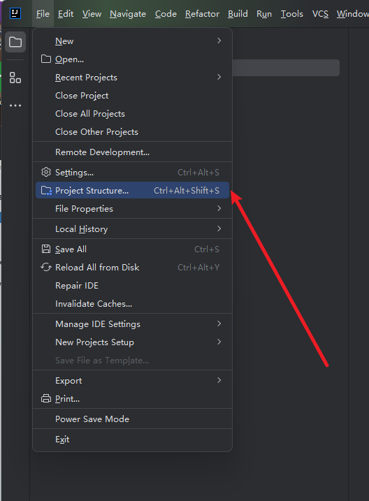

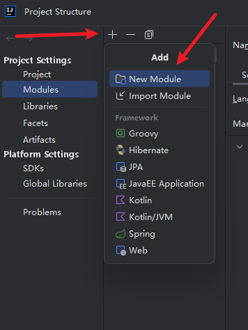

spring-quickstart 

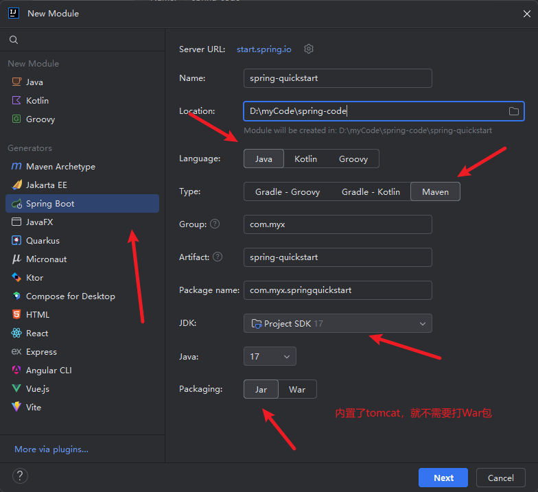

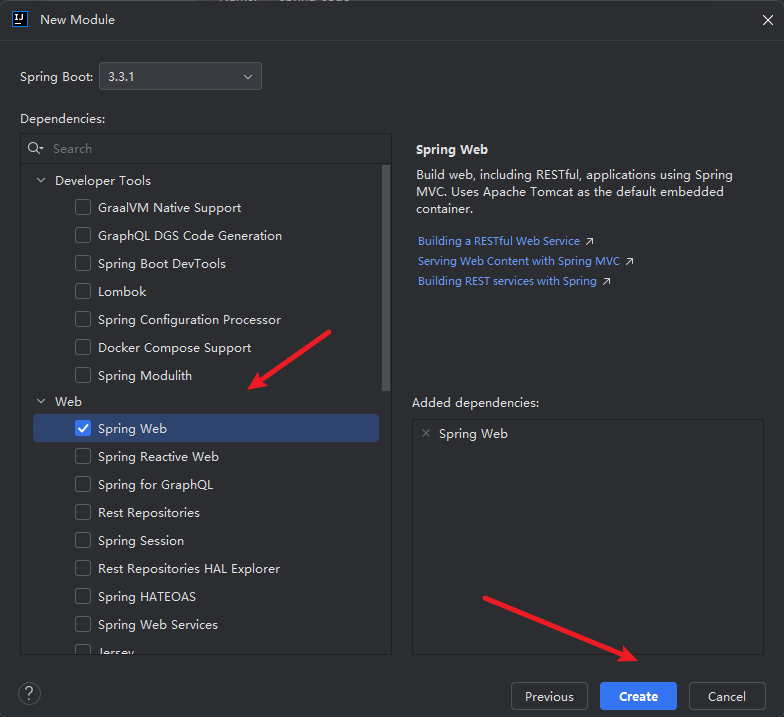

项目的目录一定是 下面这样的，还会自动下载依赖

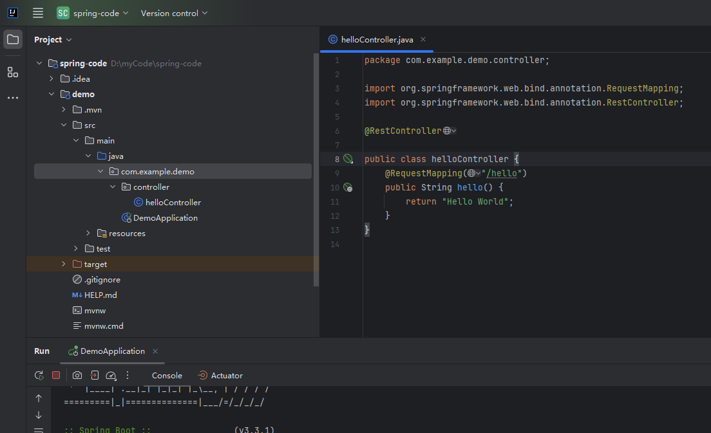

新建 controller 

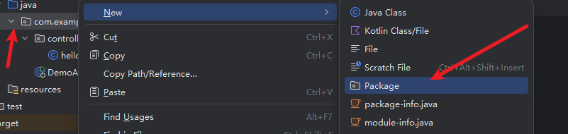

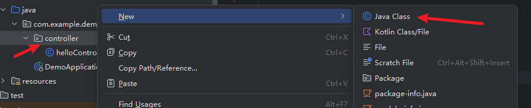

```java
package com.example.demo.controller;

import org.springframework.web.bind.annotation.RequestMapping;
import org.springframework.web.bind.annotation.RestController;

@RestController

public class helloController {
    @RequestMapping("/hello")
    public String hello() {
        return "Hello World";
    }
}

```

浏览器 输入  http://localhost:8080/hello  就可以看到Hello World 了

## 配置文件

1. `properties` 配置文件
2. `yaml` 配置文件

旧的：

https://docs.spring.io/spring-boot/docs/current/reference/html/application-properties.html#fappendix.application-properties
新的：

https://docs.spring.io/spring-boot/how-to/properties-and-configuration.html

`application.properties`文件

```
spring.application.name=demo
server.port=9090
server.servlet.context-path=/start
```

使用 yaml 配置：

把 `application.properties` 修改为 `application.properties.bak`

此时 spring boot 就不再认识这个配置文件了

再到 `resources`目录下 新建一个`application.yaml` 文件

```yaml
server:
  port: 9191
  servlet:
    context-path: /start
```

## yml 配置信息书写和获取


## Spring Boot 整合 mybatis

mysql 下载地址

https://dev.mysql.com/downloads/windows/installer/8.0.html

https://downloads.mysql.com/archives/community/

执行下面的 sql 文件

使用 IDEA 自带工具 或者 navicat

```sql
create database if not exists mybatis;

use mybatis;

create table user
(
    id     int unsigned primary key auto_increment comment 'ID',
    name   varchar(100) comment '姓名',
    age    tinyint unsigned comment '年龄',
    gender tinyint unsigned comment '性别, 1:男, 2:女',
    phone  varchar(11) comment '手机号'
) comment '用户表';

insert into user(id, name, age, gender, phone)
VALUES (null, '白眉鹰王', 55, '1', '18800000000');
insert into user(id, name, age, gender, phone)
VALUES (null, '金毛狮王', 45, '1', '18800000001');
insert into user(id, name, age, gender, phone)
VALUES (null, '青翼蝠王', 38, '1', '18800000002');
insert into user(id, name, age, gender, phone)
VALUES (null, '紫衫龙王', 42, '2', '18800000003');
insert into user(id, name, age, gender, phone)
VALUES (null, '光明左使', 37, '1', '18800000004');
insert into user(id, name, age, gender, phone)
VALUES (null, '光明右使', 48, '1', '18800000005');
```

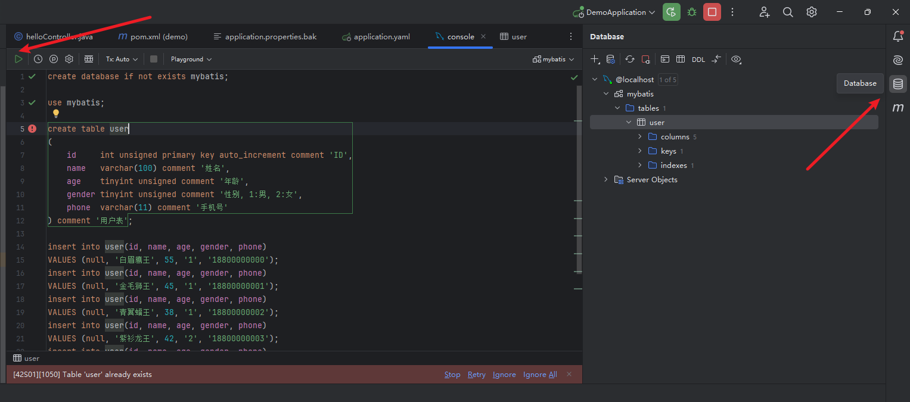

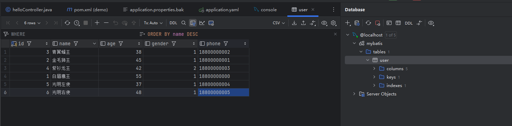

`pom.xml`

```xml
<!--    mysql驱动依赖    -->
        <dependency>
            <groupId>com.mysql</groupId>
            <artifactId>mysql-connector-j</artifactId>
        </dependency>
        <!--    mybatis的起步依赖    -->
        <dependency>
            <groupId>org.mybatis.spring.boot</groupId>
            <artifactId>mybatis-spring-boot-starter</artifactId>
            <version>3.0.0</version>
        </dependency>


```

:::tip tips

添加后之后需要使用 Maven 更新下载这个依赖

:::


接下来去完成数据源信息的配置

`application.yaml`

```

```


## mybatis使用注解完成增删改查

- 查询:`@Select`
- 添加:`@Insert`
- 修改:`@Update`
- 删除:`@Delete`

提示:

注解完成简单功能。

配置文件完成复杂功能。


## IEDA去掉sql语句黄色警告

SQL dialect is not configured. MySQL, BigQuery, MariaDB match best

https://blog.csdn.net/weixin_45309636/article/details/108740212

IDEA出现Unable to resolve column

https://blog.csdn.net/weixin_39940206/article/details/107520871

## pojo

在 Java 项目中，`pojo`（Plain Old Java Object）通常用来定义类型和数据模型

## UserController

`UserController` 是控制层，负责处理用户请求并将结果返回给前端。通常使用 `@RestController` 注解。

## UserService

`UserService` 是服务层，包含业务逻辑。通常使用 `@Service` 注解。

## UserMapper

`UserMapper` 是数据访问层，使用 MyBatis 进行数据库操作。通常使用 `@Mapper` 注解或者在 `mapper` 包中自动扫描。

通常，开发流程从数据访问层 (`UserMapper`) 开始，然后是业务逻辑层 (`UserService`)，最后是控制层 (`UserController`)。

### 注册接口

UserController

```
@PostMapping("/register")
public返回价类型register(String username, String password){
	//用户名是否已被占用
	//注册
}
```

UserService

```
//根据用户名查询用户
public User findByUsername(String username) {
//注册
public vold register(String username,String password) {
}
```

UserMapper

```
-查询
select * from user where username=?;
-插入
insert into user(username,password,create time,update time) values (?,?,?,?);
```


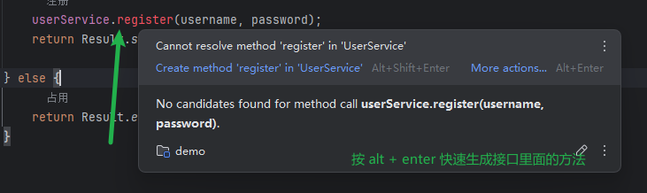

## 原理解释：MyBatis自动映射

让我们深入了解一下 MyBatis 如何处理查询结果，并将其自动映射到 `User` 对象中。

### 查询结果

假设 `user` 表中有以下数据：

| id   | username   | password | create_time         | update_time         |
| ---- | ---------- | -------- | ------------------- | ------------------- |
| 1    | john_doe   | secret   | 2023-07-10 10:00:00 | 2023-07-10 10:00:00 |
| 2    | jane_smith | password | 2023-07-10 11:00:00 | 2023-07-10 11:00:00 |

### SQL 查询

当你调用 `findByUserName("john_doe")` 方法时，MyBatis 会执行如下的 SQL 查询：

```
sql
复制代码
SELECT * FROM user WHERE username = 'john_doe';
```

这个查询会从 `user` 表中找到 `username` 为 `john_doe` 的记录，并返回如下结果：

| id   | username | password | create_time         | update_time         |
| ---- | -------- | -------- | ------------------- | ------------------- |
| 1    | john_doe | secret   | 2023-07-10 10:00:00 | 2023-07-10 10:00:00 |

### 自动映射

MyBatis 会将上述查询结果的`每一列`映射到 `User` 类的相应字段中。假设你的 `User` 类定义如下：

```
java复制代码package com.example.pojo;

public class User {
    private int id;
    private String username;
    private String password;
    private Timestamp createTime;
    private Timestamp updateTime;

    // getters and setters
}
```

MyBatis 的映射过程如下：

1. **字段匹配**：MyBatis 会根据列名和 `User` 类的字段名进行匹配。比如，查询结果中的 `id` 列会映射到 `User` 类的 `id` 字段，`username` 列会映射到 `User` 类的 `username` 字段，以此类推。
2. **对象创建**：MyBatis 会创建一个新的 `User` 对象。
3. **设置值**：MyBatis 会将查询结果中的值设置到 `User` 对象的相应字段中。例如，将 `id` 列的值 `1` 设置到 `User` 对象的 `id` 字段，将 `username` 列的值 `john_doe` 设置到 `User` 对象的 `username` 字段，等等。

最后，`findByUserName` 方法返回这个填充了数据的 `User` 对象。

## 关于打印

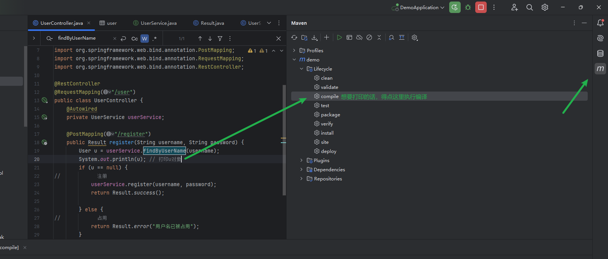


## lombok

### @Data

`@NoArgsConstructor`：生成一个无参构造函数。

`@AllArgsConstructor`：生成一个包含所有字段的构造函数。

`@Data`：生成 getter、setter、`toString`、`equals` 和 `hashCode` 方法。

## Spring Validation 校验

Spring 提供的一个参数校验框架,使用预定义的注解完成参数校验

1. 引入Spring Validation 起步依赖
2. 在参数前面添加@Pattern注解
3. 在Controller类上添加@Validated注解

## 全局异常处理器 

处理参数检验失败的异常

```java

package com.example.exception;

import com.example.pojo.Result;
import org.springframework.util.StringUtils;
import org.springframework.web.bind.annotation.ExceptionHandler;
import org.springframework.web.bind.annotation.RestControllerAdvice;

@RestControllerAdvice
public class GlobalExceptionHandler {
    @ExceptionHandler(Exception.class)
    public Result handleException(Exception e) {
        e.printStackTrace();
        return Result.error(StringUtils.hasLength(e.getMessage()) ? e.getMessage() : "操作失败");
    }
}


```


## JWT

JSON Web Token

https://iwt.io/

定义了一种简洁的、自包含的格式，用于通信双方以ison数据格式安全的传输信息。

组成：

1. 第一部分:Header(头)，记录令牌类型、签名算法等。例如:`{"alg":"HS256","type":"JWT”}`
2. 第二部分:Payioad(有效载荷)，携带一些自定义信息、认信息等。例如:`("id":"1",username":"Tom")`
3. 第三部分:Signature(签名)，防止Token被篡改、确保安全性，将header、payload，并加入指定秘钥，通过指定签名算法计算而来，


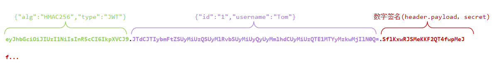


## 拦截器统一令牌校验

```java
package com.example.controller;

import com.example.pojo.Result;
import com.example.utils.JwtUtil;
import jakarta.servlet.http.HttpServletResponse;
import org.springframework.web.bind.annotation.GetMapping;
import org.springframework.web.bind.annotation.RequestHeader;
import org.springframework.web.bind.annotation.RequestMapping;
import org.springframework.web.bind.annotation.RestController;

import java.util.Map;

@RestController
@RequestMapping("/article")
public class ArticleController {
    @GetMapping("/list")
//    @RequestHeader 获取请求头
    public Result<String> list(@RequestHeader(name = "Authorization") String token, HttpServletResponse response) {
        try {
            Map<String, Object> claims = JwtUtil.parseToken(token);
            System.out.println("claims" + claims);
            return Result.success("所有的文章数据");

        } catch (Exception e) {
//            设置http响应状态码为401
            response.setStatus(401);
            return Result.error("未登录");
        }
    }

}
```

上面这样 就需要在每个接口里面写，麻烦
换成下面统一拦截

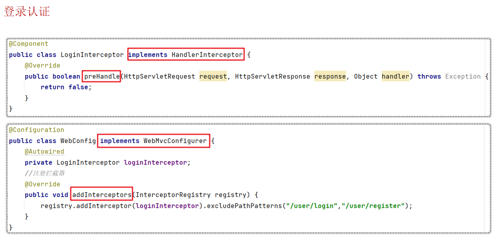


## postman统一添加请求头

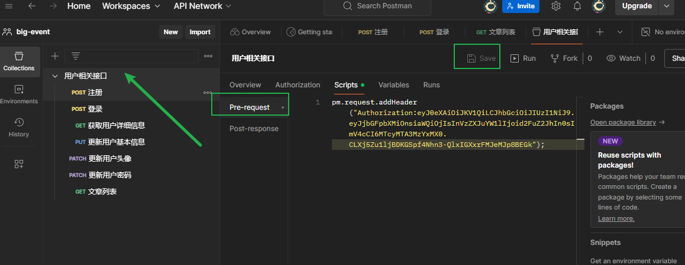

## ThreadLocal 优化 userInfo 接口

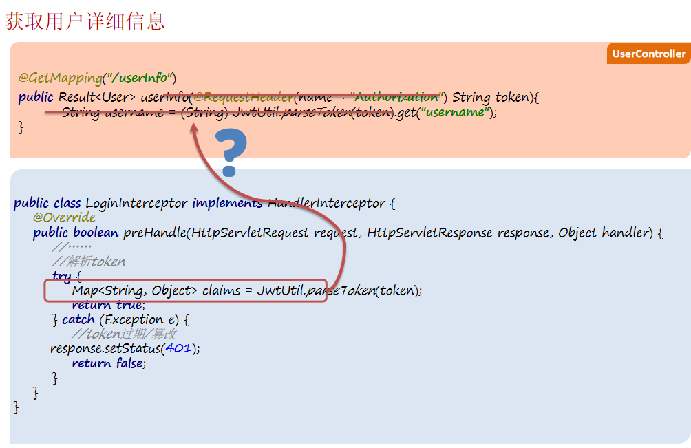

ThreadLocal ：提供线程局部变量

- 用来存取数据: set()/get()
- 使用ThreadLocal存储的数据, 线程安全


## 分组校验

把校验项进行归类分组，在完成不同的功能的时候，校验指定组中的校验项

1. 定义分组
2. 定义校验项时指定归属的分组
3. 校验时指定要校验的分组


## 文章分页查询

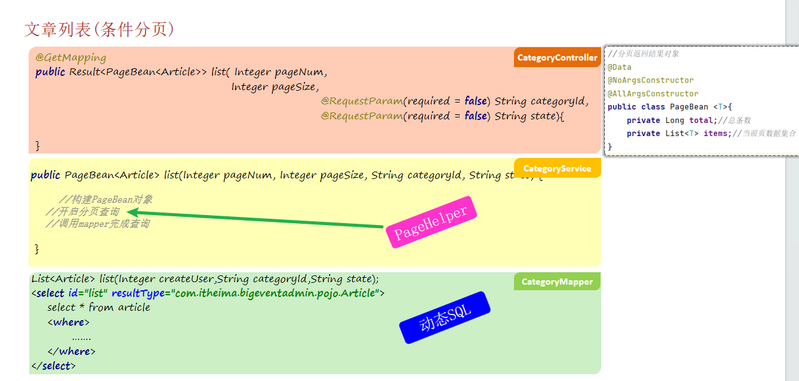


## 文件上传_本地存储

前端三要素：

1. post
2. enctype="multipart/form-data"
3. type="file"

```html
<form action="/upload" method="post" enctype="multipart/form-data">
	头像: <input type="file" name="image"><br>
	<input type="submit" value="提交">
</form>
```

后端：

- String `getOriginalFilename`(); //获取原始文件名
- void `transferTo`(File dest); //将接收的文件转存到磁盘文件中
- long `getSize`(); //获取文件的大小，单位:字节
- byte[] `getBytes`(); //获取文件内容的字节数组
- InputStream `getInputStream`(); //获取接收到的文件内容的输入流


```java
@RestController
public class FileUploadController {
    @PostMapping("/upload")
    public Result<String> upload(MultipartFile file) throws IOException {
        //把文件的内容存储到本地磁盘
        String originalFilename = file.getOriginalFilename();
        //使用UUID 保证文件的名字是唯一的，从而防止文件覆盖
        String fileName = UUID.randomUUID().toString() + originalFilename.substring(originalFilename.lastIndexOf("."));
        file.transferTo(new File("C:\\Users\\cat20\\Desktop\\bigEventFiles\\" + fileName));
        return Result.success("url访问地址....");

    }
}

```

## 文件上传_阿里云OSS存储

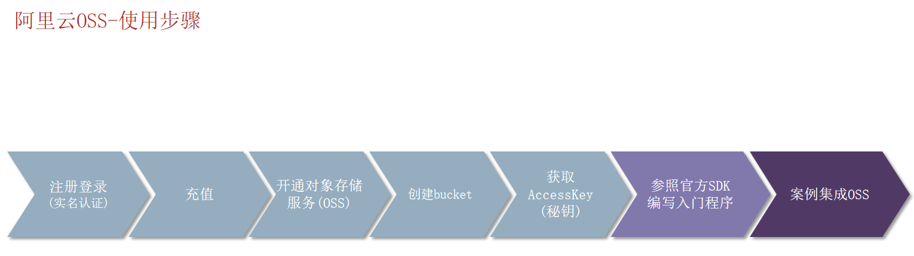

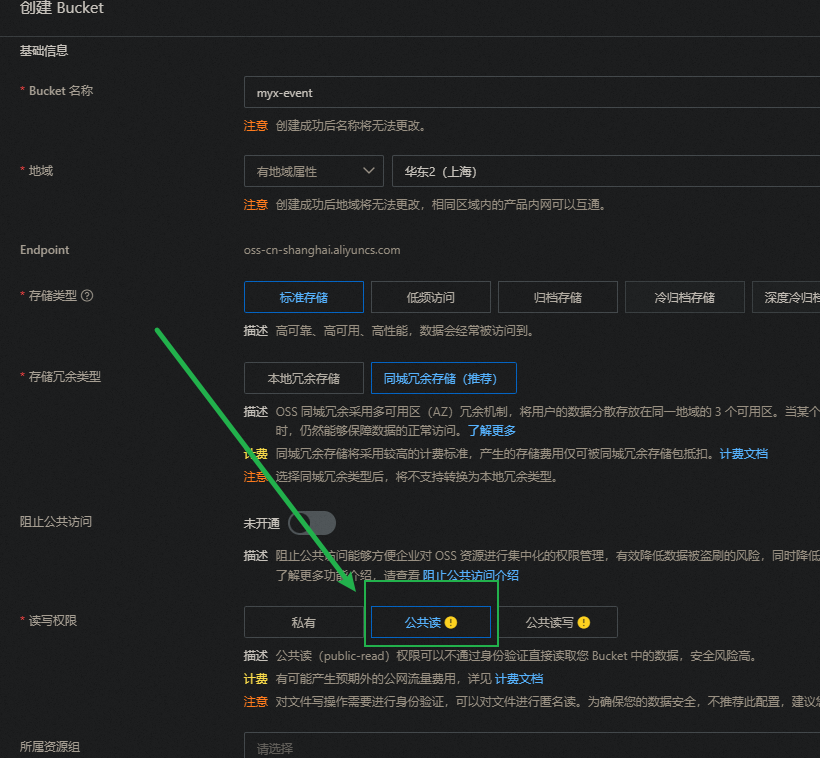


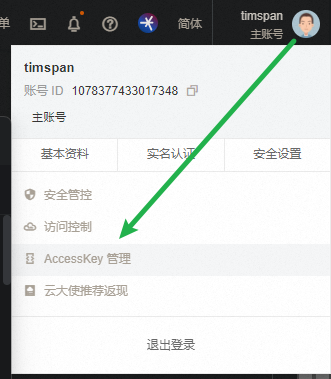

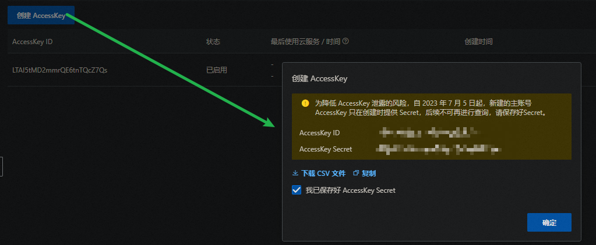

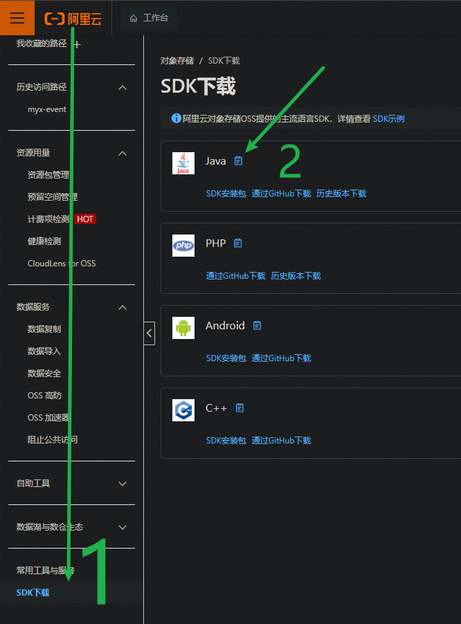


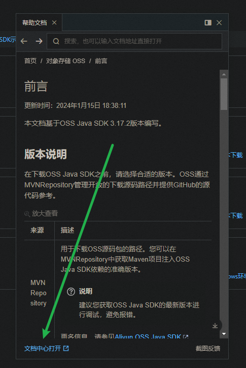


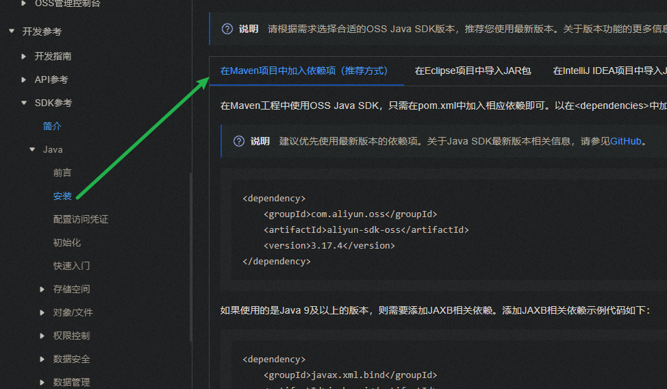

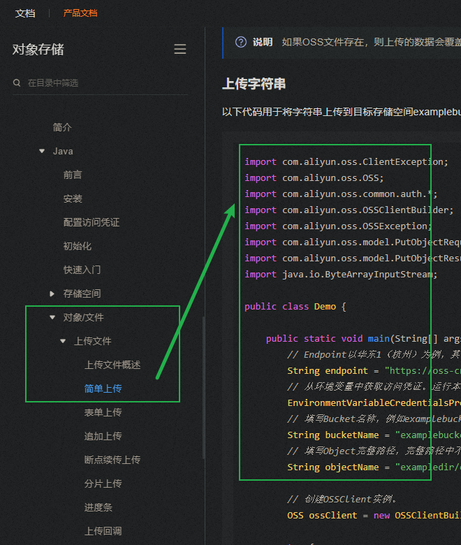

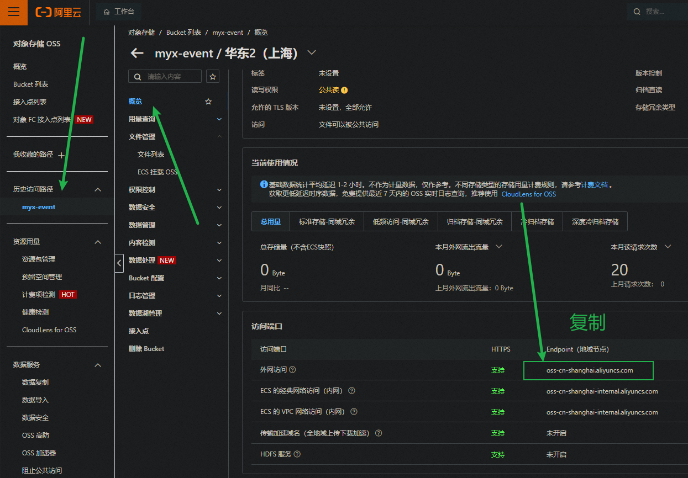

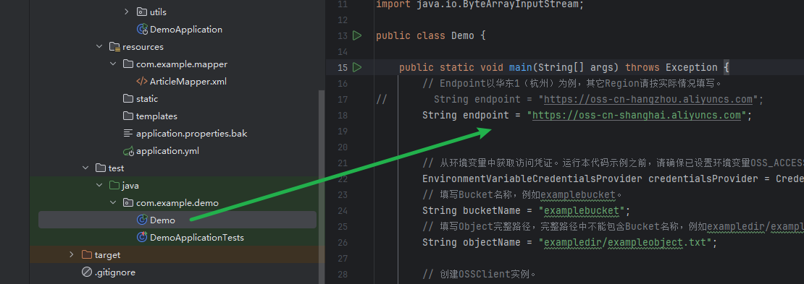

代码见源码

## 优化登录_redis主动失效

### 令牌主动失效机制

- 登录成功后，给浏览器响应令牌的同时，把该令牌`存储到redis中`
- LoginInterceptor拦截器中，需要验证浏览器携带的令牌，并同时需要获取到redis中存储的与之相同的令牌
- 当用户修改密码成功后，删除redis中存储的旧令牌


### SpringBoot集成redis

- 导入`spring-boot-starter-data-redis`起步依赖
- 在yml配置文件中,配置redis连接信息
- 调用APl(StringRedisTemplate)完成字符串的存取操作

`StringRedisTemplate 使用前需要先通过注解注入到IOC容器中`

## 项目打包

```xml
            <plugin>
                <groupId>org.springframework.boot</groupId>
                <artifactId>spring-boot-maven-plugin</artifactId>
                <version>3.0.2</version>
                <executions>
                    <execution>
                        <goals>
                            <goal>repackage</goal>
                        </goals>
                    </execution>
                </executions>
            </plugin>
```


**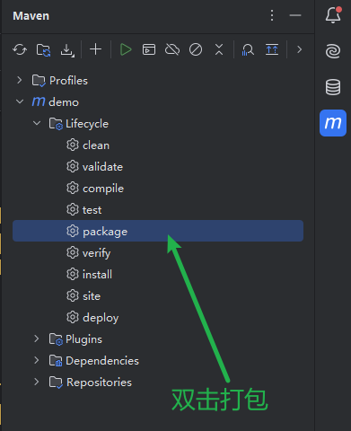**

build 成功后的 jar 包位置

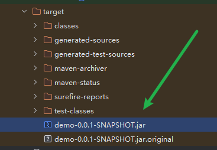

输入 java -jar  再按 tab 键盘 自动补齐

```ssh
java -jar .\demo-0.0.1-SNAPSHOT.jar
```

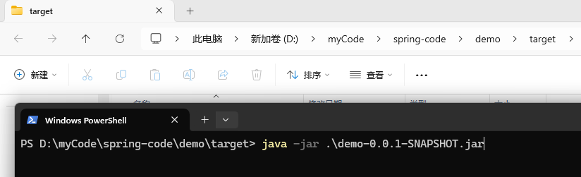

运行成功后在8080端口

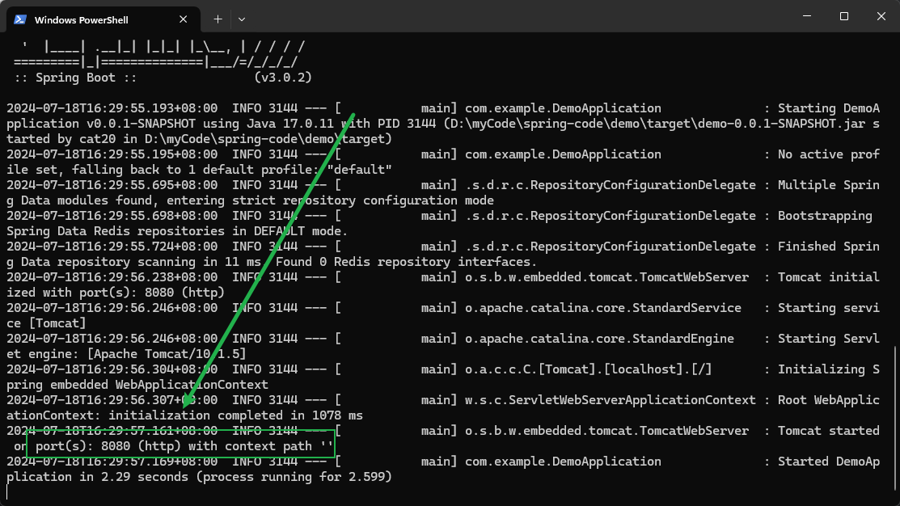

注意：需要启动 redis 服务

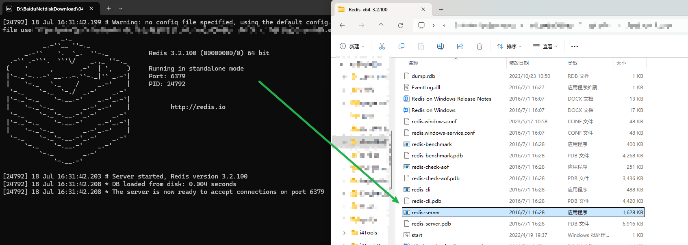
