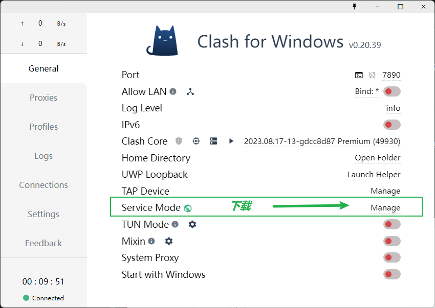
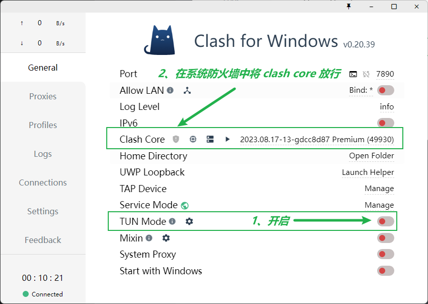
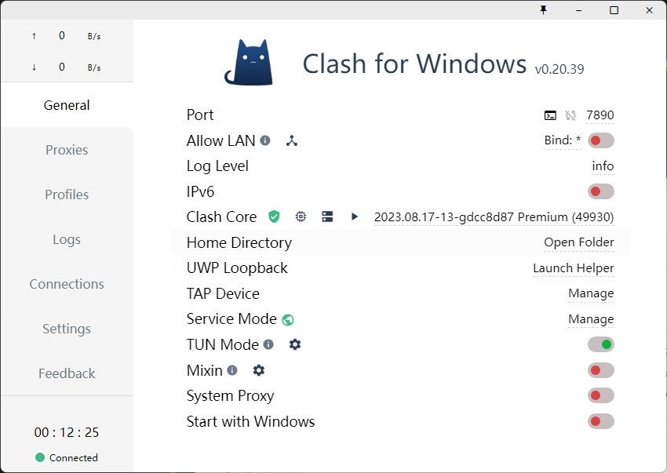
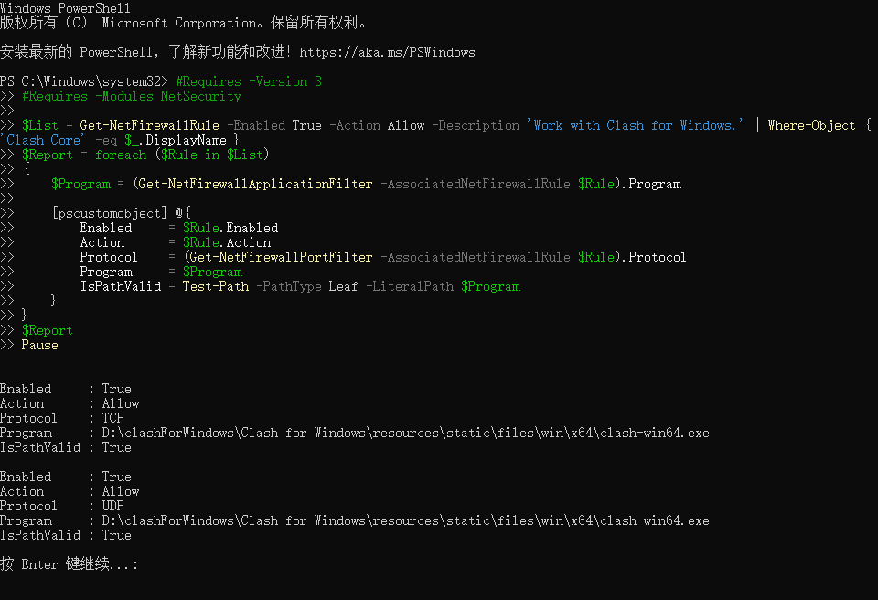
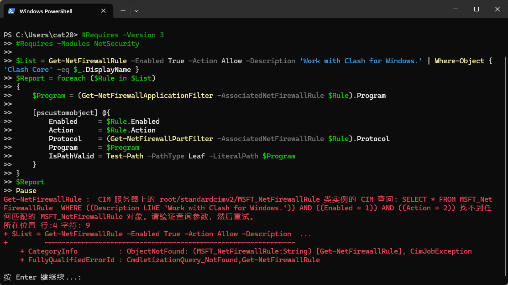

# TUN Mode

官方文档地址：https://docs.gtk.pw/contents/tun.html#windows

开启 TUN 模式就可以让系统所有软件 都走代理

比如 依赖下载慢之类的、也不用复制终端代理命令到终端

以 clash for windows 为例子







完成后的状态



NOTICE

由于查询防火墙权限受限等原因，指示灯可能无法正常工作，请以系统防火墙列表及 Clash 网卡运行状态为准。

这里提供一个可用于自查的 PowerShell 脚本（可能需要管理员权限）：

```powershell
#Requires -Version 3
#Requires -Modules NetSecurity

$List = Get-NetFirewallRule -Enabled True -Action Allow -Description 'Work with Clash for Windows.' | Where-Object { 'Clash Core' -eq $_.DisplayName }
$Report = foreach ($Rule in $List)
{
    $Program = (Get-NetFirewallApplicationFilter -AssociatedNetFirewallRule $Rule).Program

    [pscustomobject] @{
        Enabled     = $Rule.Enabled
        Action      = $Rule.Action
        Protocol    = (Get-NetFirewallPortFilter -AssociatedNetFirewallRule $Rule).Protocol
        Program     = $Program
        IsPathValid = Test-Path -PathType Leaf -LiteralPath $Program
    }
}
$Report
Pause
```

以 x86-64 版本为例，如果输出类似以下内容，那么规则添加成功（请自行验证 `Program` 路径的有效性）：

```yaml
Enabled     : True
Action      : Allow
Protocol    : TCP
Program     : C:\Program Files\Clash for Windows\resources\static\files\win\x64\clash-win64.exe
IsPathValid : True

Enabled     : True
Action      : Allow
Protocol    : UDP
Program     : C:\Program Files\Clash for Windows\resources\static\files\win\x64\clash-win64.exe
IsPathValid : True
```



失败 则是这样：



